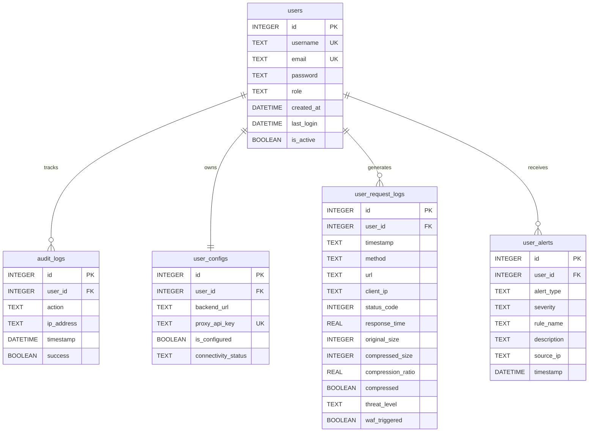

# Synorix: Smart AI-Driven Proxy — FYP-1 Milestone Report

**Department**: Department of Software Engineering (Cyber Security Program)  
**Institution**: Sir Syed University of Engineering & Technology (SSUET)  
**Project Title**: Synorix — Smart AI-Driven Reverse Proxy with Integrated Security & Optimization  

### Project Team
| S. No. | Student Name | Roll Number | Assigned Role |
|:---|:---|:---|:---|
| 1 | **Daniyal Shahid** | 2023S-BCYS-036 | AI & Optimization Lead (Machine Learning) |
| 2 | **Hamnah Waseem** | 2023S-BCYS-029 | Security & Threat Detection Lead (WAF / IDS) |
| 3 | **Isra Abbas** | 2023S-BCYS-031 | Core Proxy & Backend Lead (Go / Node.js) |
| 4 | **Maria Khan** | 2023S-BCYS-030 | Frontend & Observability Lead (React / UI) |

---

## 1. Executive Summary & Phase 1 Scope (35% Milestone)

During Phase 1 (Initial 2 Months), the Synorix team focused on establishing the **architectural foundation, module prototypes, and baseline validation** across four core engineering domains:

1. **Proxy & Routing Architecture (Isra Abbas)**: Designed the Go reverse proxy core structure, request forwarding pipelines, and initial SQLite schema for multi-tenant configuration.
2. **AI Inference Prototyping (Daniyal Shahid)**: Researched and trained initial XGBoost classification models on synthetic and benchmark web payload datasets to evaluate per-request compression suitability.
3. **Security Pipeline & Signature Analysis (Hamnah Waseem)**: Set up the standalone Suricata IDS environment on Linux, analyzed OWASP Core Rule Set (CRS) patterns, and developed baseline regex rules for application-layer exploit detection.
4. **Dashboard Layout & Authentication (Maria Khan)**: Designed the modern React/TypeScript dashboard layout, implemented JWT-based authentication flows, and established responsive navigation structures.

---

## 2. Phase 1 Challenges and Counter-Strategies

| S. No. | Encountered Challenge | Implemented Counter-Strategy |
|:---|:---|:---|
| 1 | **AI Inference Latency Overhead**: Integrating machine learning directly into a real-time proxy loop risks adding response latency. | Deployed the XGBoost model as an independent FastAPI microservice (`:8082`) with optimized vectorized feature arrays. Implemented fallback passthrough logic so traffic continues uninterrupted if the model service is unavailable. |
| 2 | **Cross-Platform Development Networking**: Developing across Windows (client/dummy target) and Linux/WSL (proxy core) caused IP routing and localhost binding complications. | Standardized the local development network using fixed virtual interface IP addressing and configured explicit CORS whitelists in Express and Vite. |
| 3 | **Multi-Service Telemetry Flow**: Synchronizing data across four separate layers (Proxy → SQLite → Express Backend → React UI) created synchronization delays. | Implemented SQLite Write-Ahead Logging (WAL mode) for lock-free concurrent reads/writes and unified data access queries under indexed user ID columns. |

---

## 3. Implemented Modules and Technologies Used

| Module | Implemented Features (Phase 1) | Technologies Used | Lead |
|:---|:---|:---|:---|
| **AI Compression Service** | Binary classification evaluating content-type, payload size, CPU load, and queue depth to predict gzip compression benefit. | XGBoost 1.7+, FastAPI, NumPy, Python 3.10 | Daniyal Shahid |
| **Go Reverse Proxy Core** | Baseline HTTP/HTTPS request interception, header forwarding, and SQLite request logging. | Go 1.21+, Gin Web Framework, `mattn/go-sqlite3` | Isra Abbas |
| **Security & IDS Layer** | Standalone Suricata IDS setup, `eve.json` parsing script, and initial OWASP regex signature definitions. | Suricata 6.0+, ET Open Ruleset, Python | Hamnah Waseem |
| **Web Management UI** | Responsive dark/navy blue dashboard layout, JWT login/signup, traffic log table, and alert preview cards. | React 18, TypeScript, Vite, Framer Motion, CSS3 | Maria Khan |
| **Backend & Persistence** | REST API for authentication, user configuration CRUD, and structured SQLite database tables. | Node.js 18+, Express.js, SQLite3 (WAL Mode), bcryptjs | Isra Abbas |

---

## 4. Phase 1 Evaluation & Test Results

### 4.1 AI Compression Model Baseline
* **Dataset**: Trained on synthetic and standardized web traffic corpora (HTML, JSON, plain text, CSS, and media formats ranging from 100B to 5MB).
* **Inference Latency**: Achieved **<10ms decision time** per inference request.
* **Compression Efficacy**: Test runs on compressible text payloads demonstrated **up to 91.7% size reduction** (e.g. 38KB payload compressed to ~3KB).

### 4.2 Proxy Routing Performance
* Successfully routed HTTP/HTTPS traffic through the Go proxy core without payload corruption.
* SQLite database verified handling concurrent logging of response times, HTTP status codes, and user IDs under local test loops.

### 4.3 Security & IDS Verification
* Suricata correctly flagged simulated abnormal traffic bursts and port reconnaissance scans in virtualized testing.
* Initial WAF regex rules successfully intercepted sample SQL injection (`' OR 1=1--`) and XSS test strings.

---

## 5. Phase 1 Database Schema (SQLite)



---

## 6. Comprehensive Phase 2 Work Plan (65% Remaining — Final FYP)

Phase 2 (Months 3 to 8) represents the primary engineering and research workload required to complete the Synorix system:

```
┌─────────────────────────────────────────────────────────────────────────────┐
│                    SYNRIX PHASE 2 ROADMAP (AUG – DEC 2026)                  │
├────────────────────────────────┬────────────────────────────────────────────┤
│ Milestone & Domain             │ Key Deliverables & Responsibilities        │
├────────────────────────────────┼────────────────────────────────────────────┤
│ **1. AI Model Optimization**   │ • Integrate AI inference directly into     │
│    (Daniyal Shahid)            │   Go proxy pipeline with threshold tuning. │
│                                │ • Benchmarking inference overhead vs       │
│                                │   compression bandwidth gains.             │
├────────────────────────────────┼────────────────────────────────────────────┤
│ **2. Security Engine & IPS**   │ • Implement 50+ OWASP WAF regex engines.   │
│    (Hamnah Waseem)             │ • Automate Suricata eve.json parser to     │
│                                │   stream alerts to SQLite in real time.    │
│                                │ • Upgrade from passive IDS to active IPS.  │
├────────────────────────────────┼────────────────────────────────────────────┤
│ **3. Caching & Deduplication** │ • Implement in-memory/Redis LRU caching.   │
│    (Isra Abbas)                │ • SHA-256 Content-Defined Chunking.        │
│                                │ • Connection pooling & TLS optimization.   │
├────────────────────────────────┼────────────────────────────────────────────┤
│ **4. Dashboard Streaming & UX**│ • WebSocket real-time traffic updates.     │
│    (Maria Khan)                │ • Compliance export reports (PDF / CSV).   │
│                                │ • Bandwidth savings analytics charts.      │
├────────────────────────────────┼────────────────────────────────────────────┤
│ **5. Testing & Final Report**  │ • Automated load testing with k6/JMeter.   │
│    (All Group Members)         │ • Final 80+ page FYP thesis documentation. │
└────────────────────────────────┴────────────────────────────────────────────┘
```

---

## 7. Conclusion

Phase 1 has successfully proven the technical feasibility of the Synorix architecture, delivering independent working prototypes for proxy routing, AI inference, security monitoring, and dashboard observability. The structured Phase 2 roadmap provides a clear, credible, and well-distributed workload for all four group members to build the fully integrated final year project.
