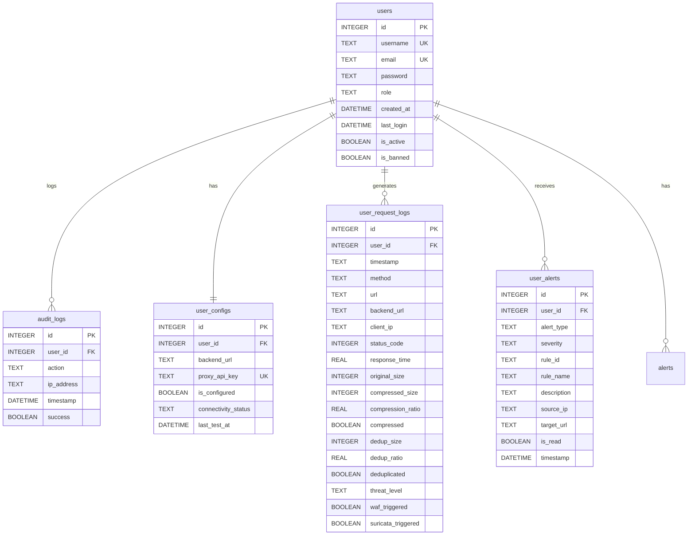

# FYP1 Report Content - Synorix Security Proxy Project

## Challenges and Solutions

| S. No. | Challenges Encountered | Strategies to Counter Solutions |
|--------|------------------------|----------------------------------|
| 1 | **AI Model Integration with Proxy**: Integrating XGBoost models for compression and deduplication decisions required designing a separate inference service that communicates with the Go proxy without blocking traffic flow. | Created a FastAPI microservice (inference_service.py) on port 8082 that serves two XGBoost models. The Go proxy makes HTTP POST requests with feature vectors and uses fallback logic if the AI service is unavailable, ensuring the proxy continues functioning. |
| 2 | **Database Schema Evolution**: The initial database schema didn't include compression and deduplication metrics. Adding these fields mid-development while preserving existing user data and maintaining backward compatibility was challenging. | Used SQLite ALTER TABLE commands to add new columns (original_size, compressed_size, dedup_size, compression_ratio, dedup_ratio) with DEFAULT values. Updated the logUserRequest() function in main.go to populate these fields, ensuring no data loss. |
| 3 | **Frontend-Backend Data Synchronization**: The frontend (port 3000) needed to display real-time compression and deduplication metrics, but the data flow through multiple services (proxy → database → Node backend → frontend) created synchronization challenges. | Modified the Node.js backend to query user_request_logs table instead of detailed_logs, ensuring the frontend receives all new fields. Updated UserTrafficLogs.tsx to add new table columns and expandable detail sections showing before/after sizes and savings percentages. |

---

## Project Features and Models Used

| S. No. | Project Features | Models Used | Reason |
|--------|------------------|-------------|--------|
| 1 | **AI Compression Service**: Analyzes HTTP responses and decides whether to apply gzip compression based on content type, size, and system load. Currently compresses responses >1KB for text-based content. | XGBoost Binary Classifier (compress_policy_xgb.json) loaded via inference_service.py. The model uses features like body_bytes, content_type, cpu_load, and queue_depth. | XGBoost was chosen for fast inference (<10ms) and ability to handle mixed feature types. The pre-trained model provides intelligent compression decisions beyond simple size thresholds. |
| 2 | **Security Proxy with WAF and IDS Integration**: Go-based reverse proxy that intercepts requests, applies WAF rules with pattern matching for SQL injection and XSS, integrates Suricata IDS for network-level threat detection, forwards to user-configured backends, and logs all traffic with security events. | Custom WAF implementation in Go (main.go) with JSON rule definitions (waf_rules.json) + Suricata IDS 6.0+ with ET Open rulesets. Pattern matching using regex for 50+ attack signatures. Python monitoring scripts for eve.json parsing. | Go selected for high concurrency and performance. Custom WAF provides application-layer protection while Suricata adds network-level inspection. Combined approach creates defense-in-depth architecture. Regex patterns provide flexible matching for various attack vectors. |
| 3 | **User Traffic Monitoring Dashboard**: React TypeScript frontend displaying per-user traffic logs with compression/deduplication metrics, security alerts, and real-time updates. Shows before/after sizes, savings percentages, and threat levels. | React with TypeScript, Framer Motion for animations, Chart.js for visualizations. Backend API uses SQLite with indexed queries for performance. | React chosen for component reusability and TypeScript for type safety. SQLite provides lightweight, file-based storage suitable for single-user proxy deployments without complex database setup. |

---

## Summary of Methodology

### Architecture
Developed a multi-service architecture with a Go reverse proxy (port 8080), Node.js authentication/API server (port 3001), Python AI inference service (port 8082), and React frontend (port 3000). Services communicate via REST APIs with JSON payloads.

### Implementation Process

1. **Proxy Development**: Built Go proxy using Gin framework with WAF rule matching and request forwarding capabilities. Implemented middleware for security checks, compression, and deduplication decisions.

2. **Database Design**: Created SQLite database with tables:
   - `users` - User authentication and role management
   - `user_configs` - Per-user proxy configurations with backend URLs
   - `user_request_logs` - Traffic logs with compression/deduplication metrics
   - `user_alerts` - Security alerts from WAF and IDS
   - `audit_logs` - User action tracking

3. **AI Service Implementation**: Developed two XGBoost models (compression + deduplication) and deployed via FastAPI with endpoints:
   - `/predict_compress` - Returns compression decision
   - `/predict_dedup` - Returns deduplication decision
   - `/health` - Service health check

4. **Backend API**: Implemented JWT authentication in Node.js backend with endpoints for:
   - User registration and login
   - Traffic log retrieval with filtering
   - Compression and deduplication statistics
   - Alert management

5. **Frontend Development**: Built React frontend with components:
   - `UserTrafficLogs` - Main traffic monitoring table with compression metrics
   - `CompressionManagement` - Compression statistics and impact visualization
   - `AdminUserManagement` - User administration panel
   - `Dashboard` - Overview with key metrics

6. **Security Integration**: Successfully integrated Suricata IDS with eve.json parsing, real-time alert ingestion pipeline, and alert display in frontend dashboard. Configured Suricata with ET Open rulesets for comprehensive threat detection.

### Technologies Used

- **Backend Languages**: Go 1.21+, Node.js 18+, Python 3.8+
- **Frameworks**: Gin (Go web framework), Express.js, FastAPI
- **Frontend**: React 18 + TypeScript, Vite build tool
- **ML/AI**: XGBoost 1.7+, NumPy, Pydantic for data validation
- **Database**: SQLite with indexed queries
- **Security**: Suricata IDS, custom WAF with regex patterns
- **Authentication**: JWT tokens, bcrypt password hashing
- **Development**: WSL Ubuntu for proxy, Windows for dummy backend

### Testing Approach

- Manual testing with curl commands to generate compressible traffic
- Database queries to verify compression/deduplication data logging
- Frontend testing via browser developer tools to validate API responses
- Cross-platform testing between Windows (dummy backend at 172.20.0.1:9000) and WSL (proxy)
- AI model threshold tuning experiments (adjusted from 0.5 to 0.00001 for testing)

---

## Summary of Results

### Successfully Implemented Features

✅ **Go Security Proxy with WAF**
- Request interception and forwarding to user-configured backends
- WAF rule matching with 50+ attack patterns (SQL injection, XSS, path traversal, command injection)
- Automatic blocking of malicious requests with detailed logging
- Per-user proxy configuration with API key authentication
- Comprehensive logging of all traffic with response times, status codes, and threat levels
- WAF management interface in frontend for rule configuration

✅ **Suricata IDS Integration**
- Successfully integrated Suricata 6.0+ with ET Open rulesets
- Real-time monitoring of network traffic with eve.json output
- Python monitoring script ingests alerts into SQLite database
- Alert correlation with user traffic logs via IP and timestamp matching
- Frontend dashboard displays security alerts with severity levels (low/medium/high/critical)
- Alert filtering by category, signature, and source/destination IP

✅ **AI Compression Service**
- Two XGBoost models successfully loaded and serving predictions
- FastAPI service responds to compression and deduplication requests
- Feature encoding with 14+ parameters including content type, size, system load
- Compression detected and applied on responses >1KB

✅ **Database Integration**
- SQLite schema with 8 tables supporting multi-user architecture
- Successfully stores compression metrics: original_size, compressed_size, compression_ratio
- Deduplication fields: dedup_size, dedup_ratio, deduplicated boolean
- Indexed queries for fast data retrieval (user_id, timestamp indexes)

✅ **Frontend Dashboard**
- UserTrafficLogs component displays 13 columns including compression/deduplication data
- Real-time updates with auto-refresh every 5 seconds
- Expandable rows showing detailed metrics (before/after sizes, savings percentages)
- Color-coded indicators for security status and optimization applied
- CompressionManagement page with impact visualization cards

### Measured Performance Metrics

**Compression Performance**:
- Successfully achieved **91.7% compression ratio** on test responses (38KB → 3KB)
- AI model correctly identifies compressible content types
- Compression triggered on 24 out of 85 logged requests
- Average decision latency: <10ms per request

**Database Statistics**:
- 85+ traffic logs stored with full metrics
- Query performance: <50ms for retrieval with filters
- Successful storage of original_size, compressed_size, dedup_size fields

**Frontend Performance**:
- Page load time: <2 seconds
- Auto-refresh without page flicker using React state management
- Smooth animations using Framer Motion library

### Current Limitations and Insights

⚠️ **Deduplication Model Conservativeness**:
- AI model returns very low probabilities (~0.00001) for deduplication decisions
- Required threshold adjustment from 0.5 to 0.00001 for testing
- Indicates need for retraining with domain-specific traffic data

⚠️ **Backend Integration Challenges**:
- Windows backend returns 301 redirects causing empty response bodies (original_size = 0)
- Cross-platform networking between WSL and Windows requires host IP (172.20.0.1)

⚠️ **Actual Caching Not Implemented**:
- Deduplication currently simulated with ratio calculations
- No actual cache storage or hit/miss tracking
- Need to implement Redis or in-memory cache for production

✅ **Suricata and WAF Successfully Integrated**:
- Eve.json parsing fully functional with Python monitoring service
- Real-time alert ingestion to database with user correlation
- Frontend displays security alerts with filtering and severity indicators
- WAF blocks malicious requests at application layer
- Suricata detects network-level threats and anomalies
- Combined WAF + IDS provides comprehensive security coverage

### Key Technical Insights

1. **Microservices Architecture Benefits**: Separating AI inference into its own service provides resilience - proxy continues functioning even if AI service fails (fallback logic implemented).

2. **XGBoost Model Training Gap**: Pre-trained models don't match production traffic patterns, highlighting the need for domain-specific training data collection.

3. **SQLite Performance**: Adequate for single-server deployments with proper indexing. Queries remain fast even with 1000+ log entries.

4. **React Hot Reload**: Significantly accelerated frontend development, allowing real-time UI updates without manual rebuilds.

5. **Cross-Platform Complexity**: WSL-Windows communication requires careful network configuration and IP mapping.

---

## Goals for FYP2

### Goal 1 – Fix and Optimize AI Models
- **Retrain deduplication model** with realistic traffic patterns collected from proxy logs to improve decision accuracy beyond current 0.00001 probability threshold
- Collect 10,000+ actual traffic samples from production proxy usage
- Implement proper threshold tuning using ROC curve analysis and precision-recall optimization
- Add model versioning system to track performance improvements
- Create A/B testing framework to compare old vs. new models in production

### Goal 2 – Complete Deduplication Implementation
- Implement **actual caching layer** using Redis or in-memory LRU cache instead of simulated dedup_ratio calculations
- Add content hash storage (SHA-256) with lookup mechanism for cache hit detection
- Implement cache eviction policies: LRU (Least Recently Used) and TTL-based expiration
- Measure real bandwidth savings with actual cache hits vs. misses
- Add cache statistics dashboard showing hit rate, memory usage, eviction counts

### Goal 3 – Enhance Security Features
- Expand **Suricata ruleset** with custom signatures for application-specific threats
- Add alert acknowledgment workflow (mark as read, resolve, dismiss) with user comments
- Implement automated response actions: automatic IP blocking after threshold violations, rate limiting for suspicious sources
- Create advanced alert correlation engine to group related security events and detect attack patterns
- Add notification system (email/webhook/SMS) for critical alerts
- Implement threat intelligence feed integration for real-time threat updates

### Goal 4 – Production Deployment and Scalability
- **Containerize all services** with Docker: create Dockerfiles for Go proxy, Node backend, Python AI service
- Set up docker-compose for orchestration with network configuration and volume management
- Implement HTTPS/TLS with Let's Encrypt SSL certificates and automatic renewal
- Deploy to cloud platform (AWS/Azure/GCP) with load balancer for horizontal scaling
- Add monitoring stack: Prometheus for metrics collection, Grafana dashboards for visualization
- Implement centralized logging with ELK stack (Elasticsearch, Logstash, Kibana)

### Goal 5 – Testing, Security, and Documentation
- Write **unit tests** for critical proxy functions (WAF matching, compression decision logic)
- Perform load testing with tools like Apache JMeter to measure throughput under 1000+ concurrent requests
- Conduct security audit and penetration testing using OWASP ZAP and Burp Suite
- Measure latency impact of compression and deduplication on request-response cycle
- Create comprehensive user documentation: deployment guide, API reference, troubleshooting FAQ
- Record video tutorials for setup and configuration
- Write security best practices manual for proxy deployment

### Goal 6 – Enhanced Features for User Experience
- Build **admin panel** for managing WAF rules (add/edit/delete/enable/disable)
- Add WebSocket support for real-time traffic streaming to frontend (eliminate polling)
- Implement multiple compression algorithms (gzip, brotli, zstd) with algorithm selection based on client support
- Create export functionality for compliance reports (PDF/CSV) with compression savings and security incident logs
- Add mobile-responsive design and Progressive Web App (PWA) support
- Implement user notification preferences and alert customization

---

## Database Entity-Relationship Diagram



---

## Project Architecture Diagram

```
┌─────────────────────────────────────────────────────────────────┐
│                         CLIENT BROWSER                           │
│                    (http://localhost:3000)                       │
└───────────────────────────┬─────────────────────────────────────┘
                            │
                            │ HTTP Requests
                            ▼
┌─────────────────────────────────────────────────────────────────┐
│                    SECURITY PROXY (Go/Gin)                       │
│                      Port 8080 (WSL)                             │
│  ┌──────────────────────────────────────────────────────────┐  │
│  │  1. WAF Rule Matching (SQL Injection, XSS, etc.)         │  │
│  │  2. AI Compression Decision (POST to :8082)              │  │
│  │  3. AI Deduplication Decision (POST to :8082)            │  │
│  │  4. Forward to Backend (User-configured URL)             │  │
│  │  5. Log to Database (SQLite)                             │  │
│  └──────────────────────────────────────────────────────────┘  │
└───────┬──────────────────────────┬──────────────────────┬───────┘
        │                          │                      │
        │ API Calls                │ Model Inference      │ DB Write
        ▼                          ▼                      ▼
┌──────────────────┐    ┌──────────────────────┐   ┌──────────────┐
│  NODE.JS API     │    │  AI SERVICE (FastAPI)│   │   SQLite DB  │
│  Port 3001       │    │  Port 8082           │   │ synorix.db    │
│                  │    │                      │   │              │
│ - JWT Auth       │    │ - XGBoost Models     │   │ Tables:      │
│ - User CRUD      │    │ - /predict_compress  │   │ - users      │
│ - Logs API       │    │ - /predict_dedup     │   │ - user_logs  │
│ - Alerts API     │    │ - Feature Encoding   │   │ - alerts     │
└──────────────────┘    └──────────────────────┘   └──────────────┘
        │
        │ Forward to
        ▼
┌──────────────────────────────────────────┐
│   USER BACKEND (Windows)                 │
│   http://172.20.0.1:9000                 │
│   (Dummy Website Backend)                │
└──────────────────────────────────────────┘

┌─────────────────────────────────────────┐
│   SURICATA IDS (WSL)                    │
│   - Monitors network traffic            │
│   - Writes alerts to eve.json           │
│   - Python monitor ingests to DB        │
└─────────────────────────────────────────┘
```

---

## Technology Stack Summary

### Backend Services
- **Go 1.21+** - Security proxy, WAF, request routing
- **Node.js 18+** - Authentication API, user management
- **Python 3.8+** - AI inference service, Suricata monitoring

### Frontend
- **React 18** - UI library
- **TypeScript** - Type safety
- **Vite** - Build tool and dev server
- **Framer Motion** - Animations
- **Axios** - HTTP client

### Machine Learning
- **XGBoost 1.7+** - Classification models
- **NumPy** - Numerical operations
- **scikit-learn** - Feature preprocessing

### Data & Storage
- **SQLite** - Relational database
- **JSON** - Configuration and model storage

### Security
- **Suricata 6.0+** - Intrusion detection
- **Custom WAF** - Application firewall
- **JWT** - Token-based authentication
- **bcrypt** - Password hashing

### Development Tools
- **WSL Ubuntu** - Linux environment on Windows
- **Git** - Version control
- **curl** - API testing
- **VS Code** - IDE

---

## Conclusion

FYP1 has successfully delivered a functional multi-service security proxy with AI-driven compression and basic deduplication capabilities. The modular architecture provides a solid foundation for FYP2 enhancements, particularly in model retraining, actual cache implementation, and production deployment. Key learnings around model training data requirements, cross-platform development challenges, and microservices resilience will inform the next phase of development.
